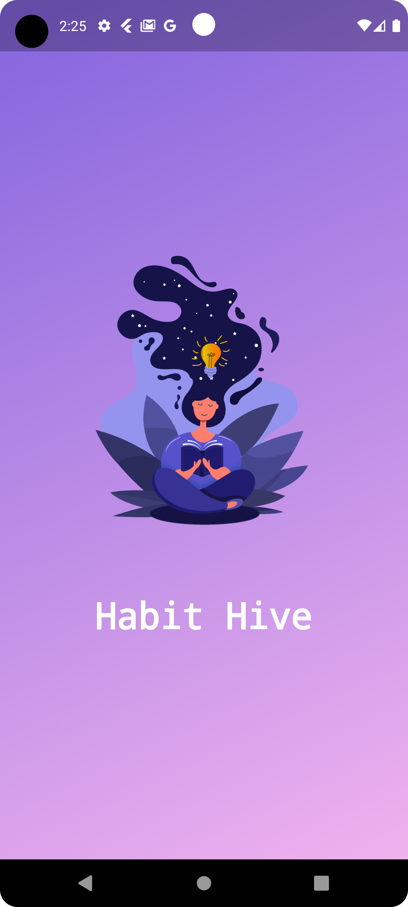
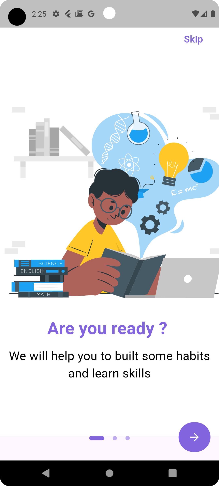
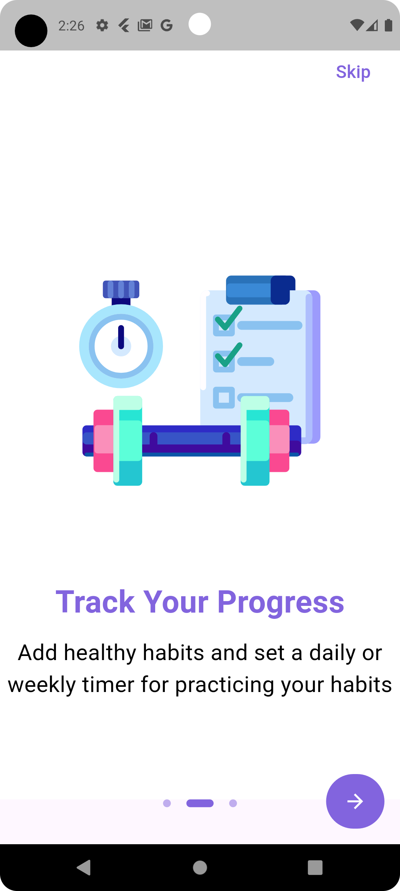
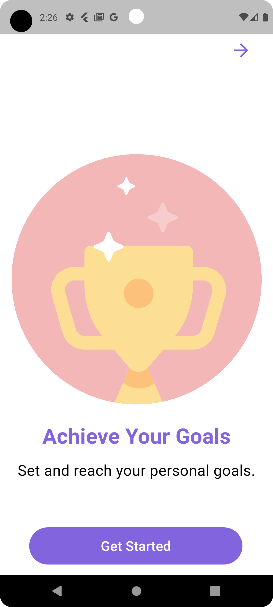
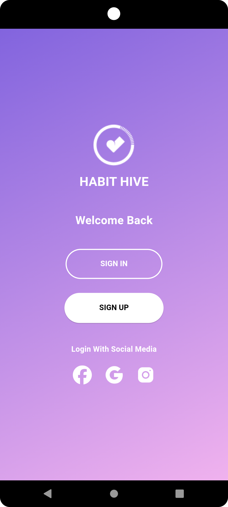
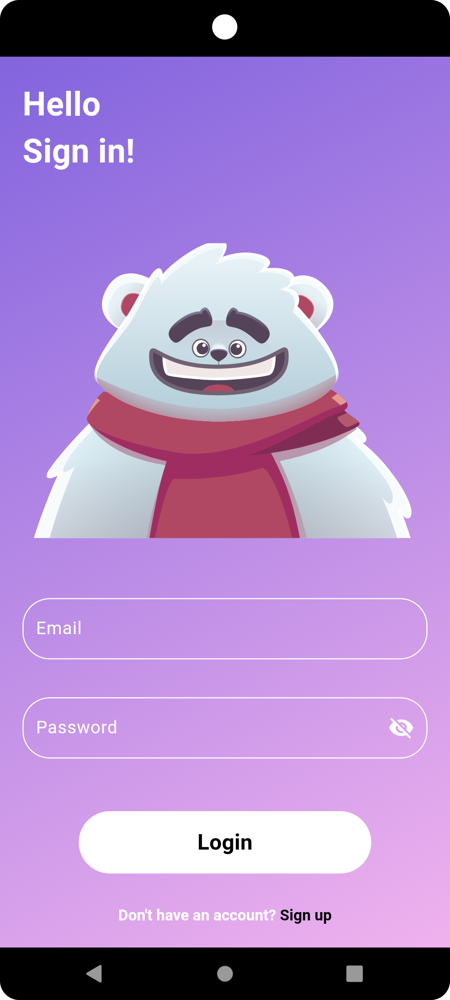
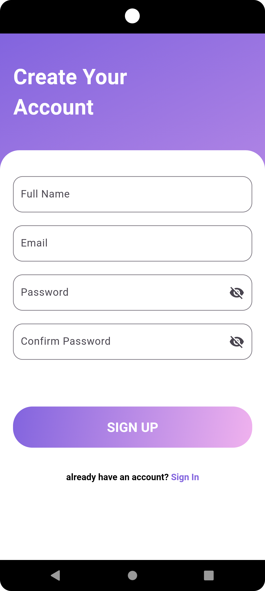
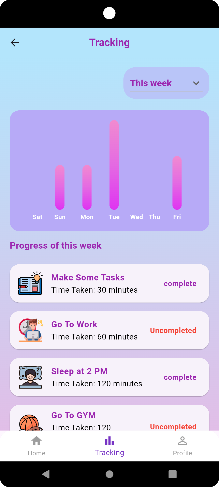

# Habit Tracking App

**Overview**

The Habit Tracking App empowers users to build and sustain meaningful daily and weekly habits with ease and clarity. Designed for those who want to take control of their personal growth, the app combines a seamless, user-friendly experience with powerful tools that keep you motivated and on track. Set goals, visualize your progress, and achieve more with features that make habit tracking simple and impactful.

## ✨ Key Features
Secure Authentication
Access the app with Google or email and password authentication options. (Facebook and Instagram login options coming soon!)

Comprehensive Habit Management
Easily create habits with detailed descriptions, duration, dates, and categories, such as Work, Study, or Sports.

Real-Time Progress Monitoring
Track your daily habit progress directly on the Home Page.

Weekly Insights with Visual Charts
Visualize your weekly progress with engaging charts, showing habit completion rates and helping you stay motivated.

Daily Notifications
Never miss a habit! Get reminders at 1 PM daily to keep you on track.

## 🚀 Getting Started
Welcome Page Options

Login: Use your email and password to sign in.
Sign Up: Register with your email to receive a verification link. Verify your account to activate it.
Login with Google: Access quickly with your Google account.
Home Page Overview

Add, edit, or delete habits.
Monitor daily progress easily.
Habit Tracking

Click on a habit's description to open the Habit Tracking page. Analyze daily and weekly progress with a visual chart showing completion rates for all tracked habits.
Profile Management

Access your Profile to view or update personal details, change your password, log out, or delete your account.

## 📸 App Screenshots
Splash Screen

  

Onboarding

    

Welcome Screen

  

Authentication Screens

   

Home Page & Habit Management

  

Adding & Editing Habits

   

Tracking Habits

   

Profile Page

   

